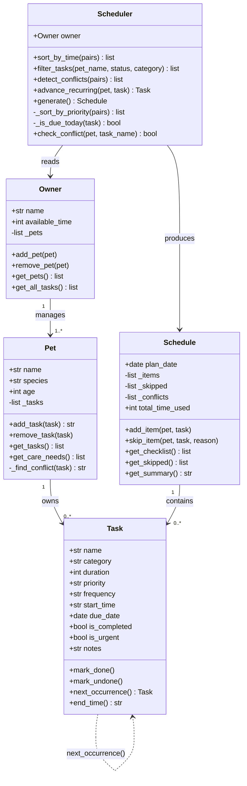

# PawPal+ — Final UML Class Diagram

Paste the code block below into https://mermaid.live to render the diagram.

```mermaid
classDiagram
    class Task {
        +str name
        +str category
        +int duration
        +str priority
        +str frequency
        +str start_time
        +date due_date
        +bool is_completed
        +bool is_urgent
        +str notes
        +mark_done()
        +mark_undone()
        +next_occurrence() Task
        +end_time() str
    }

    class Pet {
        +str name
        +str species
        +int age
        -list _tasks
        +add_task(task) str
        +remove_task(task)
        +get_tasks() list
        +get_care_needs() list
        -_find_conflict(task) str
    }

    class Owner {
        +str name
        +int available_time
        -list _pets
        +add_pet(pet)
        +remove_pet(pet)
        +get_pets() list
        +get_all_tasks() list
    }

    class Schedule {
        +date plan_date
        -list _items
        -list _skipped
        -list _conflicts
        +int total_time_used
        +add_item(pet, task)
        +skip_item(pet, task, reason)
        +get_checklist() list
        +get_skipped() list
        +get_summary() str
    }

    class Scheduler {
        +Owner owner
        +sort_by_time(pairs) list
        +filter_tasks(pet_name, status, category) list
        +detect_conflicts(pairs) list
        +advance_recurring(pet, task) Task
        +generate() Schedule
        -_sort_by_priority(pairs) list
        -_is_due_today(task) bool
        +check_conflict(pet, task_name) bool
    }

    Owner "1" --> "1..*" Pet : manages
    Pet  "1" --> "0..*" Task : owns
    Scheduler --> Owner : reads
    Scheduler --> Schedule : produces
    Schedule "1" --> "0..*" Task : contains
    Task ..> Task : next_occurrence()
```
